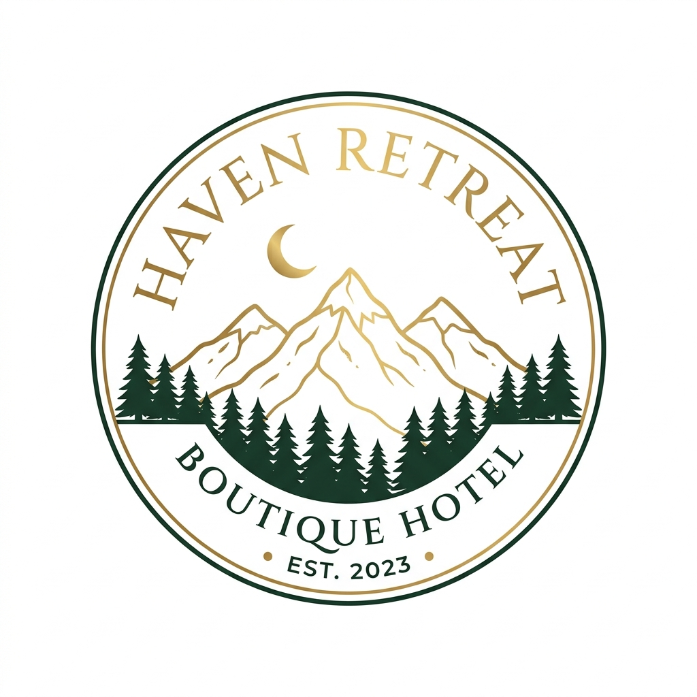

# Haven Retreat — Boutique Hotel HTML Template



A premium, fully responsive HTML template designed for **luxury boutique hotels, resorts, and B&B establishments**.

---

## 📁 File Structure

```
boutique-hotel-template/
├── assets/
│   ├── css/
│   │   ├── style.css          ← Core design system & variables
│   │   ├── extended.css       ← Page-specific component styles
│   │   ├── components.css     ← Form validation & newsletter
│   │   └── rtl.css            ← Right-to-left layout support
│   ├── js/
│   │   └── main.js            ← All interactive features
│   └── images/
│       ├── logo.png           ← Hotel logo (replace with client's)
│       └── favicon.svg        ← Browser tab icon
├── pages/
│   ├── index.html             ← Homepage (Resort Style)
│   ├── index-2.html           ← Homepage (B&B Style)
│   ├── rooms.html             ← Rooms & Suites listing
│   ├── services.html          ← Services & Amenities
│   ├── gallery.html           ← Photo gallery with lightbox
│   ├── about.html             ← About Us page
│   ├── contact.html           ← Contact form + map
│   ├── booking.html           ← Booking / reservation
│   ├── dashboard.html         ← Guest dashboard
│   ├── 404.html               ← Custom error page
│   └── coming-soon.html       ← Pre-launch / maintenance
├── serve.json                 ← Local dev server config
├── sitemap.xml                ← SEO sitemap
├── robots.txt                 ← Search engine rules
└── README.md                  ← This file
```

---

## 🚀 Quick Start

### Run Locally
```bash
npx serve . --listen 5500
```
Then open: **http://localhost:5500**

---

## 🎨 Customization Guide

### 1. Colors
Edit CSS variables in `assets/css/style.css` (`:root` block):
```css
--primary: #A88655;        /* Gold — main brand color */
--primary-hover: #8A6D44;  /* Darker gold for hover states */
--secondary: #1F1C18;      /* Dark espresso — footer, navbar */
--accent: #E0C59A;         /* Light gold — highlights */
```

### 2. Fonts
Currently using Google Fonts. Change in each HTML `<head>`:
```html
<link href="https://fonts.googleapis.com/css2?family=YOUR+FONT..." rel="stylesheet">
```
Then update in `style.css`:
```css
--font-heading: 'Playfair Display', serif;
--font-body: 'Inter', sans-serif;
```

### 3. Logo
Replace `/assets/images/logo.png` with your client's logo.
Recommended size: **200×60px**, transparent background (PNG).

### 4. Favicon
Replace `/assets/images/favicon.svg` with your custom SVG favicon.

### 5. Hotel Name & Content
Search for `Haven Retreat` across all HTML files and replace with client's hotel name.

### 6. Google Maps
In `contact.html` and `index.html`, replace the `<iframe src="...">` URL with the client's location embed URL from [Google Maps Embed API](https://developers.google.com/maps/documentation/embed/get-started).

### 7. Room Prices & Details
Edit the room cards in `rooms.html` and `index.html` with actual prices and descriptions.

### 8. Contact Details
Replace placeholder contact info in all pages:
- `123 Luxury Lane, Nature Valley` → actual address
- `+1 (555) 123-4567` → actual phone
- `hello@havenretreat.com` → actual email

---

## 🌙 Dark / Light Mode
Dark mode is built-in. The toggle button (☽/☀) in the navbar switches themes.
System preference is detected automatically on first visit.

---

## 🌍 RTL Support
To enable RTL layout (for Arabic, Hebrew, etc.):
1. Add `dir="rtl"` to the `<html>` tag
2. Add `<link rel="stylesheet" href="../assets/css/rtl.css">` to the `<head>`

---

## 📋 Pages Overview

| Page | Purpose |
|------|---------|
| `index.html` | Main landing page — hero, rooms, testimonials |
| `index-2.html` | Alternative B&B style homepage |
| `rooms.html` | All 6 rooms with rich detail & filter |
| `services.html` | Services, spa, dining, amenities |
| `gallery.html` | Masonry gallery with filter & lightbox |
| `about.html` | Story, team, timeline, values |
| `contact.html` | Contact form, map, info |
| `booking.html` | Reservation form |
| `dashboard.html` | Guest portal with booking history |
| `404.html` | Custom not-found page |
| `coming-soon.html` | Pre-launch with countdown timer |

---

## 🔌 Integration Points

| Integration | Location | Notes |
|-------------|----------|-------|
| Contact Form | `contact.html` | Add `action="https://formspree.io/f/YOUR_ID"` to `<form>` |
| Newsletter | Footer of all pages | Connect to Mailchimp/ConvertKit API |
| Google Maps | `contact.html`, `index.html` | Replace embed URL |
| Booking System | `booking.html` | Connect to preferred PMS/channel manager |
| Payment | `booking.html` | Add Stripe.js or PayPal SDK |

---

## ✅ Quality Checklist

- [x] All pages responsive (mobile/tablet/desktop)
- [x] Dark & light mode
- [x] RTL support (`rtl.css`)
- [x] Semantic HTML5 markup
- [x] Unique title & meta description per page
- [x] Smooth scroll & reveal animations
- [x] Skeleton loaders for images
- [x] Form validation with error messages
- [x] Google Maps embed
- [x] Custom 404 page
- [x] Coming soon page with countdown
- [x] Sitemap.xml & robots.txt
- [x] JSON-LD structured data

---

## 📄 Credits

- **Fonts**: [Google Fonts](https://fonts.google.com) — Inter, Playfair Display
- **Images**: [Unsplash](https://unsplash.com) — Free to use
- **Maps**: Google Maps Embed API
- **Icons**: Unicode emoji (replace with Font Awesome for production)

---

## 📞 Support

For customization help or issues, contact your template provider.

---

## 📝 Changelog

### v1.0.0 — April 2026
- Initial release
- 11 pages including 404 and Coming Soon
- Dark/light mode, RTL support
- Guest dashboard with booking history
- Masonry gallery with lightbox
- Reveal animations & scroll progress
